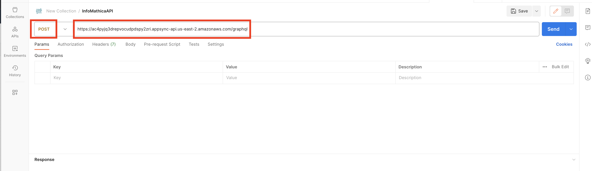
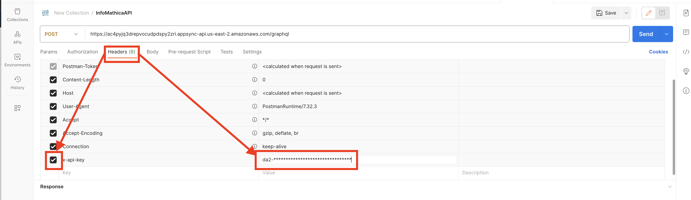
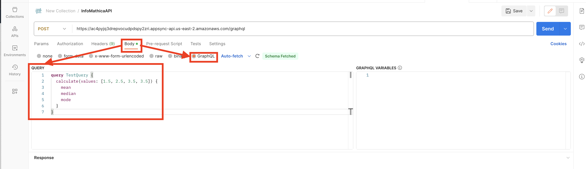

# Gaggle Take Home Challenge Overview
Welcome to the README for my GraphQL InfoMathicaAPI, deployable utilizing AppSync and CloudFormation.

I am beyond thankful and honored to have the opportunity to take this assessment.  Thank you so much for taking the time to put this together for me.  

I, and I alone, am responsible for the source code; I received absolutely no help on this assessment from anyone.  I used AWS tutorials, AWS
documentation and API docs and a significant amount of energy and effort.  I hope you enjoy my solution.

Shane Snediker

## Getting Started
Follow these steps to test, run locally and deploy the API

- ## Testing
> 1. Open the API testing tool of your choice.  I used [Postman](https://www.postman.com/)
> 2. Create a new POST request window and input the following endpoint URL:
> https://ac4pyjq3drepvocudpdspy2zri.appsync-api.us-east-2.amazonaws.com/graphql
> 
> 
> 3. Choose the `Headers` tab and select a new k/v pair populating the key with `x-api-key` and the value with the API Key shared in the submission email
> 
> 
> 4. Next, choose the `Body` tab, select the `GraphQL` radio button and input a GraphQL QUERY into the Query window and push `Send`. I pre-calculated the mean, median and mode on a set of input numbers so that I would be able to immediately tell if the API endpoint returned an accurate result
> 
> 

- ## Global Prerequisites
> - AWS Account
> - AWS CLI >= 2.7.16
> - AWS CDK Toolkit >= 2.93.0
> - Node.js >= 14.21.3
> - Python >= 3.9.6
> - Terminal
> 

- ## Run Locally and Deploy
> Follow these steps to configure the AppSync API locally and deploy:
> 1. From your AWS account, configure a new IAM User profile with `AdministratorAccess` and create an access key for this user and save the key and secret key
> 2. Confirm that you have the following prerequisites installed by executing the following commands from a terminal:
>    - `aws --version`
>    - `cdk --version`
>    - `node --version`
>    - `python3 --version`
> 3. Open a new folder on your machine using an IDE and using the `AWS Access Key ID` and `AWS Secret Access Key` generated in step 1 execute an `aws configure` command to configure an AWS profile for your new IAM User profile
> 4. Next, bootstrap a new CDK environment on your AWS Account associated with the new IAM User:
>   - `cdk bootstrap <AWS Account ID>/<AWS Default Region> --profile <profile-name>`
> 5. Go to the Github repository linked in the submission email and copy the clone link.  Using the clone link and the Github Personal Access Token provided in the submission email, clone the repo into your new folder:
>    - `git clone https://<Personal-Access-Token>@<git-clone-link> .`
> 6. Configure a Python Virtual Environment to the project and run the following 2 commands to install local project dependencies into your virtual environment:
>   - `source venv/bin/activate` on Mac/Linux or 
>   - `pip install -r requirements.txt`
> 7. Lastly, to deploy the new API, run the following 2 CDK commands:
>   - `cdk synth`
>   - `cdk deploy`
> 

